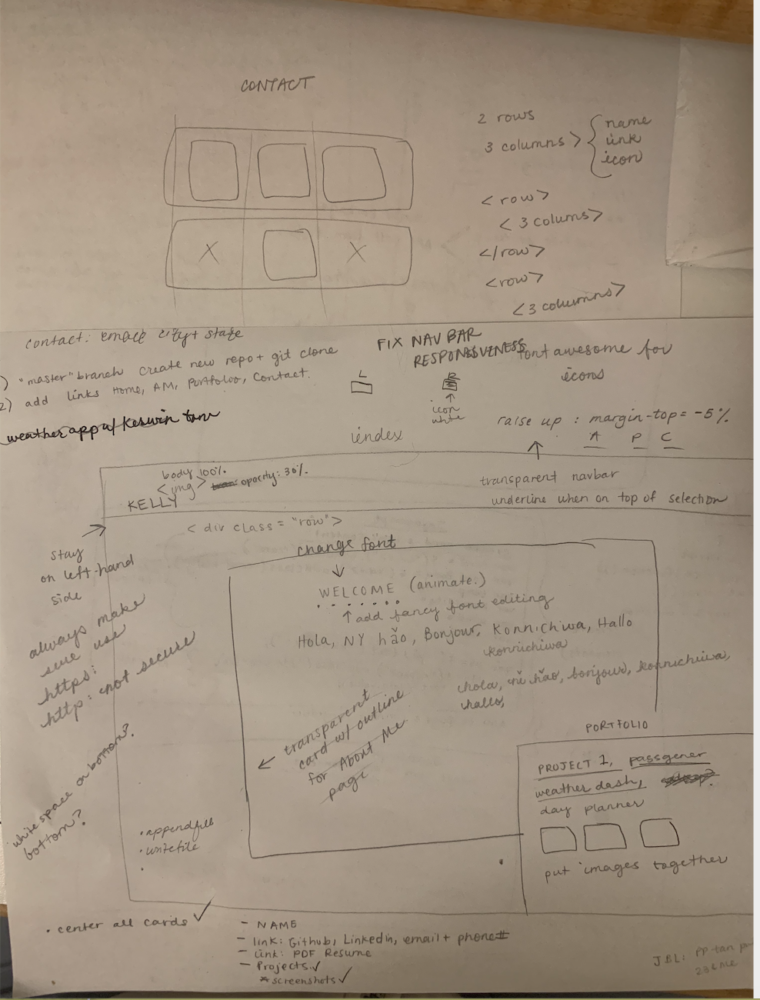

<br>
<u>

<center>

# Updated Portfolio 

</u>

<u>

## Goal: 

</u>
</center>

### Our goal for this assignment was to redesign our previous portfolio project! I took this opportunity to get creative and design something different from how it looked before.I am pleased with the outcome and seeing how far I've come in a few weeks makes this one of my favorite homework assignments thus far!

<br>


The first thing I did for this assignment was to figure out what I wanted to do. My previous portfolio had looked quite plain, and so I made sure to design it to something I would be proud of. I would've liked to experiment with more animations that I have in mind, and I will definitely continue learning more so that I am able to fully execute my vision.

<br>


## Criteria:

Within this project, I included:

<center>

```
1. Responsive web page
2. Resume, Linkedin, Github and Email
3. Aesthetic web layout
4. Linked icon and pages

 ```

</center>


<br>

<u>

## Issues with the project:

</u>

<br>

- I had issues with the responsiveness of a couple of the pages and images. 

    -  I solved this issue by using responsive containers and cards, and a media query for my About Me page to shrink the image down to a size that would fit a mobile screen:

  <br>

    


   <br>


<br>

## Technologies Used:

- Visual Studio Code
- Gitlab
- Terminal
- Github

<br>

## Table of Contents:
1. Goal
2. Criteria
3. Issues
4. Technologies Used
5. Table of Contents
6. Links
7. Deployed Link


<br>

## Links:

- [Link to Github](https://github.com/kellystone4/updatedPortfolio)
- [Link to LinkedIn](https://www.linkedin.com/in/kelly-a-stone/)

<br>

## Deployed Link:
- [Link to Updated Portfolio Site](https://kellystone4.github.io/updatedPortfolio/)